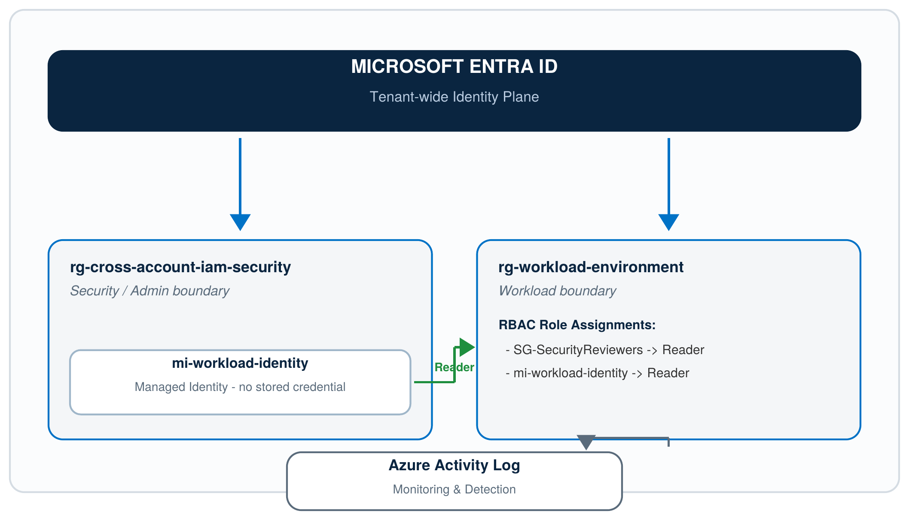

# Azure Cross-Account IAM Security


A hands-on Azure security project translating an AWS cross-account IAM access pattern into Azure-native identity and access management, using Microsoft Entra ID, Azure RBAC, Managed Identity, and Terraform.


## Project Status

Complete — see [Known Limitations](#known-limitations) for the two scope boundaries not achievable on an Azure for Students subscription (documented, not left as open work). See [Results / Proof](#results--proof) for outstanding verification evidence.


## What This Project Demonstrates

- Least-privilege access design using Azure RBAC, scoped to resource-group level

- Managed Identity for credential-free workload access (no secrets stored anywhere)

- Infrastructure as Code with Terraform, including importing pre-existing manually-created resources

- Security monitoring via Azure Activity Log

- Deliberate misconfiguration testing (over-privileged roles, overly broad scope) with detection and remediation

- Honest documentation of licensing limitations on a student subscription (e.g., PIM, Conditional Access)


## Architecture



Two Resource Groups within a single subscription simulate the AWS project's separate Security and Workload accounts. Access flows from Entra ID identities into the workload boundary through explicit, least-privilege RBAC role assignments — never through a shared "admin" role.


## Prerequisites

- An Azure subscription (this project was built on Azure for Students)

- Azure CLI installed

- Terraform installed (v1.5.0+)

- Git installed

- A GitHub account


## Setup — Step by Step


### 1. Clone this repository

```bash

git clone https://github.com/srushtipatil-1/azure-cross-account-iam-security.git

cd azure-cross-account-iam-security

```


### 2. Authenticate to Azure

```bash

az login

az account show

```

Confirm the correct subscription appears before continuing.


### 3. Create the two Resource Groups (Security and Workload boundaries)

```bash

az group create --name rg-cross-account-iam-security --location centralindia

az group create --name rg-workload-environment --location centralindia

```


### 4. Create the Entra ID Security Group

```bash

az ad group create --display-name "SG-SecurityReviewers" --mail-nickname "SG-SecurityReviewers"

```


### 5. Create the User-Assigned Managed Identity

```bash

az identity create --name mi-workload-identity --resource-group rg-cross-account-iam-security --location centralindia

```


### 6. Assign least-privilege RBAC roles

Fetch the group's object ID and the identity's principal ID:

```bash

az ad group show --group "SG-SecurityReviewers" --query id --output tsv

az identity show --name mi-workload-identity --resource-group rg-cross-account-iam-security --query principalId --output tsv

```

Assign Reader to both, scoped to the workload resource group:

```bash

az role assignment create --assignee "<GROUP_ID>" --role "Reader" --scope "/subscriptions/<SUBSCRIPTION_ID>/resourceGroups/rg-workload-environment"

az role assignment create --assignee "<PRINCIPAL_ID>" --role "Reader" --scope "/subscriptions/<SUBSCRIPTION_ID>/resourceGroups/rg-workload-environment"

```


### 7. Manage the same infrastructure with Terraform

```bash

cd terraform

terraform init

```

Create a `terraform.tfvars` file (never committed to Git) containing:


subscription_id = "<SUBSCRIPTION_ID>"


Import each manually-created resource so Terraform manages it going forward:

```bash

terraform import azurerm_resource_group.workload "/subscriptions/<SUBSCRIPTION_ID>/resourceGroups/rg-workload-environment"

terraform import azuread_group.security_reviewers "<GROUP_ID>"

terraform import azurerm_user_assigned_identity.workload_identity "/subscriptions/<SUBSCRIPTION_ID>/resourceGroups/rg-cross-account-iam-security/providers/Microsoft.ManagedIdentity/userAssignedIdentities/mi-workload-identity"

terraform import azurerm_role_assignment.reviewers_reader "<ROLE_ASSIGNMENT_ID_1>"

terraform import azurerm_role_assignment.identity_reader "<ROLE_ASSIGNMENT_ID_2>"

```

Confirm everything matches:

```bash

terraform plan

```

Expected result: `No changes. Your infrastructure matches the configuration.`


## Verifying the RBAC Design

```bash

az role assignment list --scope "/subscriptions/<SUBSCRIPTION_ID>/resourceGroups/rg-workload-environment" --output table

```

Expected: exactly two Reader assignments, no broader roles.


## Security Testing Performed

- Simulated an over-privileged role assignment (Contributor added alongside Reader) — detected via role assignment audit, remediated

- Simulated overly broad scope (subscription-level instead of resource-group-level) — detected using the `--all` flag on role assignment queries, remediated

The full sign-off checklist for these tests and the rest of the security review is in [`docs/security-hardening-checklist.md`](docs/security-hardening-checklist.md).


## GitHub & CI/CD Security

- **Branch protection**: `main` requires a pull request before merging (no direct pushes).

- **CI/CD pipeline** (`.github/workflows/terraform-security.yml`) runs on every push/PR to `main`:
  1. `terraform fmt -check -recursive` — blocks on formatting drift.
  2. `terraform init` / `terraform validate` — blocks on invalid configuration.
  3. `tfsec` security scan, gated at `--minimum-severity HIGH` — blocks the run on any HIGH or CRITICAL finding; MEDIUM/LOW findings are reported in the log but do not fail the job.
- This is a real gate, not a formality: an early version of this repo had a Terraform formatting issue that the pipeline correctly failed on (see commit history — `Fix Terraform formatting to pass terraform fmt -check in CI pipeline`), and the fix was verified locally before being confirmed passing in CI.


## Results / Proof

> Pending: this section needs a fresh `terraform plan` clean-state run and a current `az role assignment list` audit against the live subscription, plus a link/screenshot of the `terraform-security.yml` workflow passing on `main`. Not yet captured in this pass — see the summary at the end of this update for what's outstanding.

## Known Limitations

- This project uses a single Azure subscription (Azure for Students); two Resource Groups simulate the multi-account boundary from the original AWS design (this is why Multi-Subscription Access above is a documented limitation rather than a completed phase)

- Entra PIM and Conditional Access were evaluated but not deployed, as they require Entra ID P1/P2 licensing not included in this subscription tier


## Project Phases

| # | Phase | Status |
|---|-------|--------|
| 1 | Orientation | Done |
| 2 | Azure Environment Setup | Done |
| 3 | Identity Architecture | Done |
| 4 | Multi-Subscription Access | Documented limitation — see [Known Limitations](#known-limitations) (single subscription on Azure for Students) |
| 5 | Azure RBAC | Done |
| 6 | Secure Identity | Done |
| 7 | Infrastructure as Code | Done |
| 8 | Security Monitoring | Done |
| 9 | Security Testing | Done |
| 10 | GitHub | Done — branch protection + PR-required workflow on `main` |
| 11 | CI/CD Security | Done — `tfsec` gate in `.github/workflows/terraform-security.yml`, see [GitHub & CI/CD Security](#github--cicd-security) |
| 12 | Security Hardening & Documentation | Done — see [`docs/security-hardening-checklist.md`](docs/security-hardening-checklist.md) and this README |

